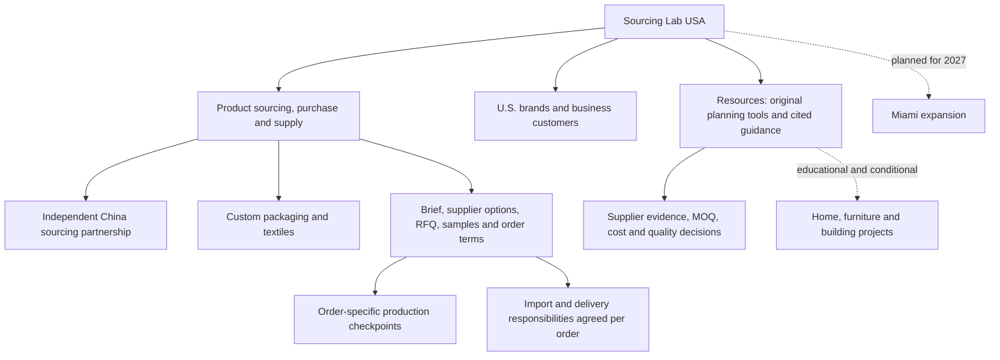

# Sourcing Lab USA — GEO, SEO, entity and conversion audit

Audit date: September 14, 2026. Canonical site: https://sourcinglabusa.com. Requested hostname `www.sourcinglabusa.com` redirects to the existing canonical hostname. Implementation branch: `codex/geo-authority-2026-09-14`, based on `origin/main` at `eb2eb89`. This report distinguishes the public baseline, implemented code, observations and work requiring accounts or business evidence.

## 1. Executive summary

The existing site already had a sound technical foundation: **21 public sitemap URLs, server-rendered content, unique titles and descriptions, consistent canonicals, no broken internal destinations or anchors, no unreachable sitemap pages, and maximum crawl depth of two clicks**. Replacing its URLs or producing a large set of near-identical service pages would not address the main constraint.

The largest opportunities were decision-support depth, contextual discovery of the resource hub, reusable original tools, a more explicit method, useful lead qualification and external proof. The implementation adds **10 pages**, expands the existing resource hub and two guides, adds **four downloadable worksheets**, and connects commercial pages to supplier and quality evidence. The verified build contains **31 public sitemap pages**. No existing public URL, redirect or crawler policy was removed or changed. The owner requested completion through publication; release evidence is recorded after deployment rather than inferred from a successful local build.

The strongest near-term positioning is **“Custom packaging and textile procurement partner for U.S. brands.”** The commercial offer remains sourcing, purchase and supply of products from China, with the company in France or China identified in each quotation. Miami expansion remains planned for 2027. Broader home/building subjects are introduced as educational preparation and conditional feasibility discussions, not established category expertise.

Seven actual web-search queries were recorded; the available tool returned Sourcing Lab USA URLs for two, concerning packaging and textiles. Some About-page result titles retained old language. These observations establish limited search discoverability, not Google ranking positions or citations by named AI platforms. The **120-prompt benchmark** is ready; direct AI-platform visibility remains **unmeasured**.

## 2–6. Readiness scores out of 100

| Dimension | Public baseline | Implemented version | What limits the score |
| --- | ---: | ---: | --- |
| GEO readiness | 48 | 67 | Independent corroboration and direct platform tests |
| SEO readiness | 68 | 78 | Search Console, actual indexing and field performance data |
| Entity authority | 50 | 56 | Exact legal entities, verified profiles and documented outcomes |
| AI citation readiness | 44 | 66 | Firsthand evidence and earned third-party citations |
| Conversion readiness | 52 | 65 | Live delivery verification, CRM outcomes and paid-order attribution |

These are editorial judgments, **not measured platform scores, predicted rankings or a probability of recommendation**. Each dimension uses five criteria worth 20 points each. Evidence and before/after allocations are in [readiness-scores.json](geo/readiness-scores.json). Missing proof earns no assumed authority. The actual visibility score is `null`, with zero tested AI-platform prompts, in [visibility-score.json](geo/visibility-score.json).

## 7. Technical and content issues discovered, prioritized

| Priority | Finding and evidence | Consequence | Resolution / next action |
| --- | --- | --- | --- |
| CRITICAL | Public copy says quotations identify a company in France or China, but the legal entity names/address are absent. The privacy source also flags this gap. | Buyers cannot fully corroborate the contracting business from the website. | Preserve accurate scope; request exact legal identities and have the notice/terms reviewed before adding them. Do not invent a U.S. entity. |
| CRITICAL | No authenticated Search Console, Bing Webmaster, CRM or Ads data was available. PageSpeed API returned HTTP 429 quota exhaustion. | Index coverage, CWV, search demand, backlinks and revenue attribution cannot be certified. | Mark unmeasured; obtain account exports/access and complete the measurement actions below. This is an audit limitation, not evidence that the website is down. |
| HIGH IMPACT | Resource hub had no contextual inbound links in the baseline; navigation links existed. | Buyers and retrieval systems have fewer contextual paths into the knowledge cluster. | Add homepage, About, methodology and article links to `/resources`. |
| HIGH IMPACT | Eight existing articles; MOQ and landed-cost articles lacked worked comparisons. | Limited reason to cite the site over generic guides. | Add original matrices, explicit assumptions, worksheets and two expanded examples. |
| HIGH IMPACT | Supplier qualification, quality checkpoints, direct-vs-partner comparison, fees and Canton preparation were uncovered intents. | Gaps along the route from discovery to a qualified quotation. | Seven substantial guides, organized by decision in the existing hub. |
| HIGH IMPACT | Forms asked for product type and quantity but lacked explicit budget/market/supplier/timing prompts. | Qualification requires extra clarification and raw leads obscure project fit. | Add five optional fields, collapsed by default, preserved in both existing delivery channels and email fallback. |
| HIGH IMPACT | Only form-level analytics are implemented; a lead does not establish qualification or payment. | Optimizing Ads to leads alone can reward low-value inquiries. | Document an offline funnel and paid-order/deposit objective; CRM/Ads import remains unconnected. |
| HIGH IMPACT | Search results sometimes show obsolete About wording mentioning sustainability and locations. Current page and metadata differ. | Stale entity associations may persist in retrieval. | Preserve current accurate page; inspect the URL and request recrawl in owner tools after release. Do not republish old claims to match snippets. |
| MEDIUM IMPACT | Founder `@id` ends in `/about#founder`, but the page lacked that visible anchor. | Entity reference had no matching document anchor. | Add anchor to the existing founder fact. |
| MEDIUM IMPACT | Blog renderer always used founder identity for any author string. | New organization-attributed guides would be falsely assigned to a person. | Select Person versus Organization from actual attribution; show organization contribution on expanded articles. |
| MEDIUM IMPACT | No dedicated contact, method or editorial-policy page. | Business and publishing process less easy to inspect or cite. | Add all three; preserve all existing form anchors. |
| MEDIUM IMPACT | Markdown renderer did not support GFM tables. | Comparison matrices would not become accessible HTML tables. | Add server-rendered table support and a contained scrolling region for narrow screens. |
| MEDIUM IMPACT | Several title strings are long after the brand suffix. | Possible title truncation; not by itself an indexing error. | Improve homepage relevance and new-page descriptions; avoid indiscriminate title shortening or URL changes. Monitor displayed titles and clicks. |
| LOW IMPACT | Some existing info pages are short; service pages share legitimate process language. | Length alone is not a defect, but expanded pages should keep distinct intent. | Retain useful concise pages; deepen only where a decision needs more information. |

### Scope and measurements

- **Full public inventory:** all sitemap URLs plus reachable internal marketing pages, with metadata, headings, schema, content, links, depth and assets in [live crawl](audits/2026-09-14-live.json). The final implementation inventory is in [local crawl](audits/2026-09-14-local.json).
- **Canonicalization:** `www` → non-`www` 301; canonical and sitemap origin preserved. All baseline pages were HTTP 200 at the canonical host, indexable in observed HTML/headers. This is eligibility evidence, not confirmation of Google index inclusion.
- **Duplicates/orphans:** no duplicate exact content hashes, titles or descriptions; no sitemap pages unreachable from the homepage. The crawler flags 0.749 word-set overlap between `/blog` and `/resources`: both legitimately list the same articles, one chronologically and one by buyer decision. Their introductions and organization differ. Retain both URLs; overlap is not an automatic duplicate-content verdict.
- **Broken links:** no broken internal public-page destinations or fragment anchors. Five downloads pass after implementation. External authority links were reviewed through available web retrieval/search; some government sites restrict automated access. A 403 from a reference is not treated as a proven dead link.
- **Public rendering:** every indexed page has a single H1 and substantive server-rendered text. Content does not require a form submission or a client interaction to read. Forms hydrate on the client; email remains a visible contact route.
- **Baseline transfer observations:** raw HTML ranged from about 40 KB to 108 KB. Observed fetch elapsed times were roughly 257–440 ms in one run, with cache effects. These are neither LCP nor TTFB measurements under a controlled lab protocol. No raster `` elements appeared on the crawled pages; this does not measure scripts, CSS, fonts or inline SVG cost.
- **Mobile and CWV:** the in-app browser was unavailable, but an isolated installed Chrome session through locally available Playwright completed six-page checks at 390 and 1,440 CSS pixels: no page overflow or JavaScript page errors. The expanded contact fields, table and homepage were visually inspected. Local Lighthouse 13.4.1 scored the homepage **98 mobile / 100 desktop for performance**, and 100 for accessibility, best practices and its limited SEO checks in both runs. Mobile simulated LCP was 2.26 seconds, TBT 7.5 ms and CLS 0; desktop LCP 0.59 seconds, TBT 0 and CLS 0. These are single-navigation local lab runs, with production analytics disabled locally, not field CWV or live CDN results. INP and field data remain unmeasured. See [browser observations](audits/2026-09-14-browser.json) and [lab configuration/results](audits/2026-09-14-lighthouse-local.json). The PageSpeed API attempt separately returned quota exhaustion.
- **Crawler access:** existing wildcard policy allows public pages, excludes `/app` and `/api/`. HTTP probes using Googlebot, Bingbot, OAI-SearchBot, ChatGPT-User, GPTBot, PerplexityBot and Claude-SearchBot user-agent strings returned 200 with content and no noindex header. These are user-agent probes from the audit environment, not requests from verified crawler IPs. CDN/firewall rules and real bot logs require owner access. The app and preview indexing boundaries remain protected.

Google says that standard crawlability, useful text, internal links and consistent structured data remain relevant to AI features; special AI text files or special schema are not required. No `llms.txt` file or speculative crawler override was added. See [Google's AI-feature guidance](https://developers.google.com/search/docs/appearance/ai-features).

### Verification of the implementation

- Unit suite: **105 tests passed**, including optional qualification retained in both delivery channels and excluded from analytics, plus the 4,000-character storage boundary.
- ESLint and TypeScript checks passed; production dependency audit found **0 vulnerabilities**.
- Production build succeeds with `npm run build -- --webpack`. The default local Turbopack attempt could not bind its internal port in the restricted environment; the project build configuration was not changed. Normal CI still checks the default production build.
- Production HTML audit passes across **31 pages**, **1,198 internal links** and **five downloads**, including metadata uniqueness, canonicals, social previews, one H1, JSON-LD, visible FAQ parity, dates, author identity, reference links, EN/ES alternates and indexing boundaries.
- No real inquiry was submitted, no notification email was sent, and no ad campaign was started. Tests verify application behavior with mocked delivery; receipt in the live database and notification inbox remains an owner-controlled check.
- Schema checks validate emitted JSON, identifiers, expected types and visible-content consistency. They do not claim approval by Google's Rich Results Test or guaranteed rich-result eligibility.
- Local Lighthouse identifies potential remaining bundle/CSS savings (about 48 KiB unused JavaScript, 12 KiB legacy JavaScript and render-blocking styles). These estimates do not justify removing working framework code or redesigning pages; investigate against live data if performance becomes a constraint.

## 8. Changes actually implemented

1. Preserved all 21 existing public URLs and incorporated recent main-branch work, including `/resources`, the brief-template page, founder attribution and owner-confirmed indicative benchmarks.
2. Clarified the English homepage answer and metadata around custom packaging/textile procurement for U.S. brands, while retaining product purchase/supply and France/China invoicing.
3. Added seven original educational guides, three trust/contact pages and four plain-text worksheets without requiring registration.
4. Expanded MOQ and landed-cost articles with explicit arithmetic, assumptions and comparison tables; original publication dates and author attribution remain, with visible organization update attribution.
5. Added GFM table rendering, scoped mobile table scrolling and accessible table headings.
6. Added optional purchasing budget/currency, target market/destination, customization, supplier/sample status and target timing to the form. Details are included in the existing message field, avoiding a database migration or loss in Netlify notifications. The combined brief remains limited to 4,000 characters.
7. Updated the privacy notice to describe those additional optional details.
8. Connected the resource hub, method, editorial policy, supplier worksheet and quality guide through contextual links and footer navigation.
9. Added structured author selection, article citations and organization publishing-policy references; fixed the founder anchor.
10. Added repeatable crawl and GEO-scoring utilities plus a 120-prompt benchmark and a recorded search baseline.

## 9. New pages created

| URL | Distinct intent / information gain |
| --- | --- |
| `/blog/china-sourcing-guide-us-businesses` | End-to-end buying decisions and records, with workflow matrix |
| `/blog/verify-chinese-supplier` | Identity versus capability evidence; original matrix and completeness worksheet |
| `/blog/alibaba-vs-sourcing-company` | Task ownership and contracting comparison, using a packaging scenario |
| `/blog/sourcing-agent-fees` | Compare fee basis, exclusions and product resale pricing without invented averages |
| `/blog/quality-control-checklist` | Approval checkpoints, discrepancy log and shipment-decision boundaries |
| `/blog/canton-fair-sourcing-guide` | Before/during/after workflow and meeting worksheet, without claiming attendance |
| `/blog/building-materials-sourcing-brief` | Line-item and interface questions for future home/building projects; explicit feasibility limits |
| `/how-we-work` | Current supply method, buyer approvals and external-provider boundaries |
| `/editorial-policy` | Authorship, AI assistance, source dates, original examples and corrections |
| `/contact` | Dedicated contact intent with concise qualification and business-scope explanation |

Downloads added: `supplier-evidence-worksheet.txt`, `quality-checkpoint-worksheet.txt`, `canton-fair-meeting-worksheet.txt`, `quote-comparison-worksheet.txt`. Existing `product-sourcing-brief.txt` is retained.

## 10. Pages substantially rewritten or improved

Substantial expansions: `/blog/calculating-landed-costs-merchandise`, `/blog/custom-packaging-moq-guide`, and the cluster organization/introduction of `/resources`.

Targeted improvements, not claimed as full rewrites: homepage answer/metadata and resource links, About founder anchor and trust links, existing commercial-page evidence links, all article attribution/source navigation, and the privacy explanation. Existing legal and benchmark claims were not broadened into guarantees.

## 11. Structured data implemented and preserved

Organization, verified-on-site founder Person, WebSite, existing Service, WebPage/AboutPage, CollectionPage, BreadcrumbList and BlogPosting remain connected by stable identifiers. The new contact route uses ContactPage; method and policy use WebPage. Articles expose their visible external source URLs through `citation`. Organization attribution is used for new guides; founder attribution remains on existing founder-authored articles. Expanded articles identify the organization as a contributor, without claiming personal review by the founder.

Existing FAQPage and template HowTo markup were retained where they describe visible content. No new rating, review, certification, address, client, warehouse, offer price or unverified `sameAs` was added. FAQ markup is not a Google growth shortcut: Google's current changelog says FAQ rich results stopped appearing in May 2026 and their documentation was removed in June. See [Google's documentation updates](https://developers.google.com/search/updates).

## 12. Internal linking and entity architecture

Existing intent assignments are retained: `/china-to-us-procurement` covers order/supply responsibilities; `/china-sourcing-agent` explains commercial arrangements; `/custom-packaging` and `/custom-textile` are the core category pages. `/resources` is the decision-based hub and `/blog` remains the chronological article index. No competing aliases such as `/china-sourcing` or `/custom-packaging-sourcing` were added.

New paths connect the China guide → supplier evidence → RFQ → MOQ → quality → landed cost → relevant supply page. Commercial pages lead to supplier/quality evidence, and each new guide has a relevant commercial or contact path. The homepage links directly to the hub and two decision guides. About, method and editorial policy connect business identity to the knowledge content.

A topic discussed in educational content is not automatically a service capability. Asia outside China, consolidation infrastructure and additional category expertise must not be implied by expanding `knowsAbout` or Service markup.

## 13. Content and proof gaps

The next authority gains require evidence that code cannot create: named legal entities; approved founder biography milestones; verified official business profiles; original, permission-cleared photographs; redacted sample/approval records; a real completed project; a documented problem and resolution; and legitimate third-party references.

For the first real case study, collect brief/revision, product specifications, approved sample, quote scope, production checkpoints, dated receiving record, documented deviations and resolution, and written publication permission. If figures are disclosed, preserve their basis, exclusions, currency and dates. An anonymized case still needs evidence. Never turn a hypothetical worksheet into a client success story.

For category expansion, obtain product-specific feasibility evidence, the production/partner scope, representative specification, required specialist review and a supportable quotation process before publishing a sales page. Do not treat requests for furniture, cabinets or lighting as proof of delivery experience.

## 14. Top 50 target queries

These are an **editorial intent shortlist**, not measured keyword volumes. Live research covered broad sourcing, packaging, textiles, supplier evidence, fees, building products and Canton preparation; see [search observations](geo/search-observations.json). Current search results show competing commercial/category pages, comparison lists and practical guides. A result being present is evidence of competing content, not quantified search demand.

Once Keyword Planner/Search Console data is available, evaluate `commercial intent × measured demand × citation opportunity × (6 − competition score) × relevance`, using documented 1–5 scales for all factors except demand. Until then, do not calculate a fabricated demand-weighted score. The provisional order below favors confirmed commercial relevance and useful decision content; expansion is explicitly conditional.

| # | Target query | Preferred destination / intent |
| ---: | --- | --- |
| 1 | China sourcing company for U.S. businesses | `/china-to-us-procurement` |
| 2 | custom packaging sourcing China | `/custom-packaging` |
| 3 | textile sourcing company China USA | `/custom-textile` |
| 4 | custom packaging manufacturer sourcing | `/custom-packaging` |
| 5 | China procurement company for American brands | `/china-to-us-procurement` |
| 6 | clothing sourcing partner for U.S. brands | `/custom-textile` |
| 7 | private label packaging sourcing China | `/private-label-packaging` |
| 8 | sportswear sourcing China | `/sportswear-sourcing` |
| 9 | who can help me source products from China | Homepage and procurement |
| 10 | best sourcing company for U.S. brands | Evidence-led company/procurement pages; no self-ranking claim |
| 11 | best sourcing agent for custom packaging | Packaging plus arrangement explanation |
| 12 | how to find reliable manufacturers in China | China sourcing guide |
| 13 | how to verify a Chinese supplier | Supplier evidence guide |
| 14 | supplier verification China | Evidence guide; no standalone audit offer |
| 15 | China sourcing RFQ template | Existing RFQ and brief-template pages |
| 16 | how to create an RFQ for China suppliers | Existing RFQ guide |
| 17 | custom packaging MOQ | Expanded MOQ guide |
| 18 | how to negotiate MOQ with Chinese manufacturers | MOQ guide; later broader treatment if distinct |
| 19 | China sourcing agent fees | Fee comparison guide |
| 20 | how much does a sourcing agent cost | Fee comparison guide |
| 21 | Alibaba vs sourcing company | New comparison guide |
| 22 | sourcing agent vs trading company | Existing arrangement page |
| 23 | factory vs trading company China | Evidence and arrangement guides |
| 24 | how to calculate landed cost | Expanded cost guide |
| 25 | quality control checklist China sourcing | Quality checklist |
| 26 | pre-shipment inspection explained | Quality guide; not an inspection service page |
| 27 | how to order samples from China | Quality/China guides; next distinct sample guide |
| 28 | apparel tech pack China manufacturer | Existing apparel guide |
| 29 | clothing MOQ by size and color | Existing apparel guide |
| 30 | custom clothing manufacturing China | `/custom-textile` |
| 31 | private label clothing sourcing | Textile page; future distinct offer if substantiated |
| 32 | fabric sourcing China for U.S. brands | Textile page; future distinct fabric scope |
| 33 | sustainable packaging supplier evidence | Existing environmental-claims guide |
| 34 | U.S. textile import labeling requirements | Existing textile-import guide with authorities |
| 35 | supplier evaluation scorecard China | New evidence worksheet guide |
| 36 | how to source products from China safely | China guide and evidence matrix |
| 37 | who is responsible for importing goods from China | Procurement and cost guides |
| 38 | EXW vs FOB vs CIF vs DDP | Future sourced Incoterms guide; cost guide meanwhile |
| 39 | Canton Fair sourcing guide American buyers | Canton guide |
| 40 | how to prepare for Canton Fair | Canton guide |
| 41 | questions to ask factories at Canton Fair | Canton worksheet |
| 42 | verify suppliers after Canton Fair | Canton and evidence guides |
| 43 | furniture sourcing from China | Educational project brief; sales page evidence-gated |
| 44 | home product sourcing China USA | Educational project brief; conditional scope |
| 45 | kitchen cabinet sourcing China | Educational project brief; evidence-gated sales page |
| 46 | building materials sourcing China | Educational project brief; conditional scope |
| 47 | how to import building materials from China | Educational preparation plus appointed professionals |
| 48 | how to import tiles from China | Future specialist-reviewed category guide |
| 49 | hotel restaurant project sourcing China | Project-brief education; no experience claim |
| 50 | Asia sourcing partner for U.S. companies | Current China offer; broader geography only after evidence |

## 15. Top 20 pages to create next

Each candidate requires distinct intent and enough evidence to exceed the existing guide. The paths below are proposals, not redirects or published promises.

| Order | Proposed URL | Original material needed / publication gate |
| ---: | --- | --- |
| 1 | `/blog/incoterms-for-us-buyers` | ICC-sourced allocation table, named-place examples, specialist review |
| 2 | `/blog/how-to-order-samples-from-china` | Sample types, revision log and real approved sample documentation |
| 3 | `/blog/compare-supplier-quotations` | Redacted real like-for-like comparison with exclusions and permission |
| 4 | `/blog/private-label-product-brief` | Packaging/textile component and branding worksheet; distinct from RFQ |
| 5 | `/blog/china-sourcing-payment-terms` | Payment-decision framework reviewed for actual contracting arrangements |
| 6 | `/blog/product-design-and-ip-sourcing` | Qualified legal review; no guaranteed IP protection claims |
| 7 | `/case-studies/[verified-project]` | Actual dated project, approvals, outcome and permission |
| 8 | `/custom-boxes` | Distinct box construction/sample evidence; otherwise deepen packaging page |
| 9 | `/luxury-packaging` | Documented materials/finishes, physical sample comparisons and scope |
| 10 | `/private-label-clothing` | Confirmed branded garment offer with a substantial sample/label workflow |
| 11 | `/fabric-sourcing` | Confirm whether fabric-only supply is offered; evidence before service page |
| 12 | `/cosmetic-packaging` | Explicit primary/secondary packaging scope and applicable specialist review |
| 13 | `/food-packaging` | Actual food-contact scope, material evidence and qualified review |
| 14 | `/home-product-sourcing` | Confirmed categories, feasibility process and representative evidence |
| 15 | `/furniture-sourcing` | Product/partner scope, drawings, sample evidence and U.S. review ownership |
| 16 | `/kitchen-cabinet-sourcing` | Drawing/interface process, materials and required document review |
| 17 | `/tile-and-stone-sourcing` | Category-specific specification, batch and packing evidence |
| 18 | `/bathroom-product-sourcing` | Confirmed items, installation interfaces and specialist requirements |
| 19 | `/door-and-window-sourcing` | Actual capability plus project/location-specific technical review |
| 20 | `/lighting-sourcing` | Actual category scope, electrical requirements and documentation process |

Do not create `/supplier-verification` or `/quality-control` as standalone service pages without a real change in the contracted offer. Defer a broad `/asia-sourcing` sales page until supplier geography beyond China is substantiated. A building-material hub should follow enough supported categories; it should not become a duplicate of the current project-brief guide.

## 16. Competitors and citation competition

The following are observed competitors or reference benchmarks from sampled search results and direct review. They are not an exhaustive ranking of the market, and their self-published claims were not independently verified. **Backlink counts, referring domains, share of AI citations and broad brand-mention volumes were unavailable for every competitor.** No proxy metric is presented as measured authority.

| Competitor / source | Entity and architecture observed | Trust/original-content signals visible | What Sourcing Lab USA should publish or prove |
| --- | --- | --- | --- |
| [Sourcing Allies](https://www.sourcingallies.com/us-china-sourcing-agent) | U.S.-specific commercial intent; manufacturing, process and category links | Named contact, location information, process imagery and case-study navigation | Equivalent clarity of accountable legal parties, plus a real packaging/textile approval record; do not copy its team/location claims |
| [JingSourcing](https://jingsourcing.com/) | Broad service/product ecosystem; private label, QC, shipping and tutorial paths | Founder/about pages, service explanations and educational hubs | Win a narrower buyer decision with a usable original worksheet and documented project evidence |
| [Sourcify](https://www.sourcify.com/) | Solutions, industries, regions and learning material | Case studies, named service models and podcast content | Focus packaging/textile specialization and show genuine process artifacts; no invented multinational infrastructure |
| [Wanxin Pack](https://www.wanxinpack.com/) | Packaging-specific supplier coordination and component groups | Personal brand story, direct contact, sample and MOQ explanations | Add actual approved assembly/fit examples and accountable product supply terms |
| [PACKRIVA](https://packriva.com/) | Packaging product/process pages with clear project responsibilities | Sample/inspection explanations and consolidated component intent | Publish a documented multi-component packaging decision; do not copy its independent-inspection offer |
| [Oceanport Link](https://www.oceanportlink.com/blog/chinese-supplier-evaluation-scorecard) | Supplier-scorecard article returned for the supplier-evidence query | Practical evaluation format positioned around a buyer decision | Make the evidence/unknown/contradiction distinction useful, then document how it informed a real decision |
| [LifaSourcing](https://www.lifasourcing.com/business-model-fees/) | A dedicated business-model/fees URL returned for fee intent | Explicit attempt to explain compensation | Explain the actual supply-price scope and exclusions; do not invent an agency fee to match the query |
| [FBM Sourcing](https://fbmsourcing.com/chinese-kitchen-cabinets-buyers-guide/) | Developer/project buyer guide linking to cabinet and related categories | Detailed product questions, process discussion and project CTA | Establish actual category competence and a reviewed item schedule before making comparable sales claims |

Several “best sourcing company” results are comparison lists published by providers or commercial sites. Such a list is not proof that its ranking is independent. The response should be better buyer evidence and legitimate earned references, not a self-awarded “best” badge, purchased citation list or copied competitor statistics.

## 17. 30-day action plan

| Timing | Action | Owner / completion evidence |
| --- | --- | --- |
| Days 1–3 | Review the branch and legal/business claim register; approve factual content for release | Business owner: exact entity names, founder/profile facts, category limits |
| Days 1–7 | Release reviewed code through the existing deployment pipeline; run the same crawl on production | Developer: HTTP/metadata/schema checks and all old URLs retained |
| Days 1–7 | Verify Search Console/Bing ownership, inspect home/core categories/About/resources, submit sitemap after release | Account owner: actual index/inspection exports and submission record |
| Days 3–10 | Obtain mobile and desktop lab results plus available CWV field data; inspect mobile tables, menu and contact form | Developer: named device/profile, date, LCP/INP/CLS where available; separate lab from field |
| Days 5–10 | Verify one controlled live form delivery with authorized test details, then remove the test record if appropriate | Owner: confirmed database and notification receipt; do not trigger unsolicited mail |
| Days 5–14 | Baseline 120 prompts through supported interfaces; use stable 20-prompt weekly subset | Analyst: actual transcripts, modes, dates, citations and coverage |
| Days 7–21 | Assemble one permission-cleared project evidence pack and verified official profile list | Owner: original files, source dates and permissions |
| Days 14–30 | Review query impressions and qualified inquiries; deepen the pages associated with real buyer questions | Content/sales: question log, qualification reasons and revised priorities |
| Days 21–30 | Prepare tightly scoped Ads tests on confirmed categories after tracking/landing verification | Account owner: approved budget, exclusions and economic conversion definition |

## 18. 90-day authority plan, including Canton and U.S. expansion

**Days 31–60:** publish the first evidence-backed project or sample-decision report; substantiate founder experience with approved milestones; verify official profiles and add only exact profile URLs to `sameAs`; produce the sample/quote comparison guides; obtain legitimate industry/partner references where a real relationship exists. Any outreach, messaging or paid placement requires a separate authorized action; none was sent during this audit.

**Days 61–90:** use qualified inquiries and observed search data to choose one additional category. Require a scoped quotation process, representative specifications, technical review ownership and evidence before creating the commercial page. Evaluate whether the category deserves its own cluster rather than just a section. Review 30/60/90-day visibility with the same prompt set and coverage, and compare paid orders rather than only traffic.

**Canton Fair:** prepare the product briefs and meeting worksheet now. If a company representative actually attends, collect dated attendance evidence, permission-cleared photos, product/booth references, clearly labeled supplier statements and direct observations. Publish a narrow field report answering a buyer decision, a post-fair qualification follow-up and a documented sample lesson. Do not publish attendance, visitor counts, supplier relationships, market statistics or inferred “trends” without support. Verify current arrangements with the [official organizer](https://www.cantonfair.org.cn/en-US/buyerguide).

**United States:** retain the present distinction between serving U.S. business customers and having U.S. infrastructure. In advance of 2027, prepare a factual business-identity update and location evidence only when the actual entity/operations exist. Develop importer-oriented education with current sources and qualified review. Do not claim a local office through an address placeholder, fake business listing or LocalBusiness schema.

### Paid acquisition landing strategy

| Initial intent | Landing destination | Qualification / evidence |
| --- | --- | --- |
| Custom packaging sourcing | `/custom-packaging` | Format, dimensions, quantity, artwork and sample scope |
| Clothing/textile sourcing | `/custom-textile` | Tech pack, fabric, variant quantities and destination |
| Sportswear | `/sportswear-sourcing` | Intended use, fit, material/performance evidence and samples |
| Private-label packaging | `/private-label-packaging` | Component list, artwork revision and product fit |
| China procurement | `/china-to-us-procurement` | Product scope, quotation entity, costs and responsibilities |

These existing category pages already have a specific proposition, process, FAQs and a category-aware inquiry form. The implementation adds evidence links and optional qualification. They can be the initial intent-specific destinations; duplicating them into thin ad-only pages would add little. Use a separate experiment only for a distinct ad proposition and measure it. Do not direct all ads to the homepage.

Exclude free sourcing jobs, consumer retail, unrelated dropshipping and standalone broker/inspection-service intent where it does not fit. Do not advertise furniture, cabinetry, food-contact packaging or building materials until their offer is substantiated. Campaign spending and account changes are not implemented.

## 19. Metrics to track

Track indexed canonical pages, excluded-page reasons, crawl errors, branded/non-branded impressions and clicks, landing-page conversions, validated mobile/desktop performance, resource downloads if later instrumented, and query/category movement. This implementation does not falsely claim a download event is already installed.

Track AI mentions, exact cited URLs, recommendation/context, competitors, category, model/search mode, date, region, prompt coverage and unavailable results. Use [the benchmark protocol](geo/README.md) and its script. Keep measured visibility separate from editorial readiness.

For the commercial funnel, record **lead → qualified lead → appointment → proposal → paid order/deposit → realized order value**. Current browser events cover only CTA/form actions and delivered leads. Qualification and later stages require actual operational records. The verified business sells products; a “paid sourcing engagement” must not be invented as an existing service or recorded from a button click. If that paid service is launched later, define it as a separate conversion with contractual and revenue evidence.

Use cost per qualified lead, cost per paid order, proposal-to-order rate, conversion lag, order value and contribution margin where available. Configure official offline conversion imports only after attribution, account access and privacy handling are agreed. No customer details or confidential CRM records belong in this public repository.

## 20. Risks and unsupported claims that must not be published

| Claim | Current evidence / boundary |
| --- | --- |
| U.S. office, warehouse, employees or local operating entity | Not established; Miami is planned for 2027 |
| Existing U.S. clients, completed hotel/building projects | Not documented in this audit |
| Factory ownership or exclusive supplier network | Existing relationship is an independent China partnership |
| Twenty years of founder experience | Already stated on the public About page and preserved; collect approved supporting milestones; do not turn it into company age |
| 500-unit MOQ, 1–2-week samples, 45–60-day production | Existing owner-confirmed planning figures; retain qualifiers and per-order confirmation, never guarantees |
| Independent certified inspections, factory audit service, accredited lab | Not part of the verified offer |
| Customs brokerage, freight forwarding, guaranteed clearance | Not standalone company services; responsibilities and appointed specialists are agreed per order |
| Guaranteed compliance, tariff treatment, cost savings or delivery dates | Not supportable; actual product/contract and current authority review required |
| Asia-wide supplier capability, proven furniture/cabinet/lighting expertise | Expansion subject to evidence; educational coverage is not capability proof |
| Canton Fair attendance, factory visits or field photographs | Only publish after real activity and documented permissions |
| Recognized or statistically validated proprietary framework | Worksheets are original editorial tools, not industry-recognized standards |
| Personal review by the founder of new AI-assisted guides | Not claimed; new content uses organization attribution |
| Official profiles, third-party endorsements, reviews or case studies | Add only verified identities and permission-cleared evidence |
| Legal entity names, company addresses or terms copied from a template | Obtain exact company information and qualified review |
| Guaranteed AI citation, ranking or index inclusion | Neither schema nor content changes provide that guarantee |

Relevant primary references are linked next to the statements they support in the new guides: [CBP importer responsibility](https://www.help.cbp.gov/s/article/Article-1169?language=en_US), [USITC tariff schedule](https://hts.usitc.gov/), [FTC textile guidance](https://www.ftc.gov/business-guidance/resources/threading-your-way-through-labeling-requirements-under-textile-wool-acts), [CPSC certification/testing](https://www.cpsc.gov/Business--Manufacturing/Testing-Certification/General-Use-Products-Certification-and-Testing), [EPA composite-wood requirements](https://www.epa.gov/formaldehyde/formaldehyde-emission-standards-composite-wood-products), [ICC Incoterms](https://iccwbo.org/business-solutions/incoterms-rules/incoterms-2020/), and [Canton Fair buyer information](https://www.cantonfair.org.cn/en-US/buyerguide). These sources guide product-specific review; their presence is not an endorsement or certification of this business.
